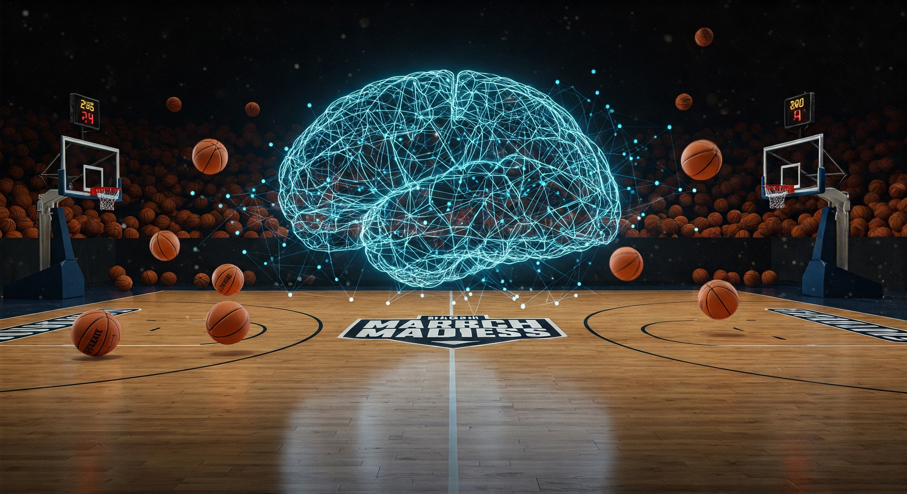

# march_madness
Train a neural network to predict head-to-head scores

[read the full blog post](https://medium.com/@matthew.j.begue/i-built-a-custom-ai-to-fill-out-my-march-madness-bracket-b25d209a1a32)




This project trains a simple feed-forward neural network to predict head-to-head scores for (in this case) NCAA basketball games.    The neural network is trained using all head-to-head games from a given season.  An embedding vector is computed for each team, the embeddings are concatenated, and the final layer predicts the score of the game.

The script `curate_data.py` uses [this](https://github.com/henrygd/ncaa-api) excellent repository's resources to scrape NCAA score data.  The training data is a pandas DataFrame object saved as a pickle.

The `march_madness.py` script is the training script that loads the training data, does necessary preprocessing, and trains the neural network.

The learned neural network weights can be saved.

I also provided a `predict` function to predict the final scores.

### Prediction Example

For example, to predict a Georgetown vs UConn matchup, simply run
```python
predict(team_lookup["UConn"], team_lookup["Georgetown"])
# Predicted Score 89.82402462 71.92521858
```
(The actual Georgetown vs. UConn game on 02-26-2025 had a final score of UConn: 93 - Georgetown: 79)